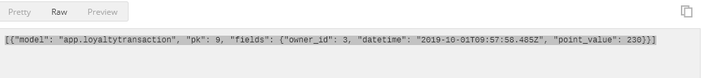

### loyalty app: API

### DOCS (REQUESTS/REQUIRED)

<b> - auth </b>  
:/GET  
root/?password=<password>&username=<username>&email=<email>
(!IMPORTANT)
for create new user use short <a target="_self" href="https://github.com/maryjanyes/loyalty-api/blob/master/how-to-manage-account.md">doc</a>

<b> - customer </b>  
:/POST  
root/customer/?name=<name>&family_name=<family_name>&email=<email>

<b> - balance </b>  
:/GET  
(retrieve balance by `customer_id`)  
root/customer/balance/?customer_id=<customer_id>  
--  
:/POST  
(create customer balance tx)  
root/customer/balance/?customer_id=<customer_id>&is_accrual=<is_accrual_tx>&count=<count_to_be_changed>
- you can got next result:

### pre-install
- `pip install -r requirements.txt`
- `python -m ./balance/clickhouse.py True`

### services
run redis!  
run clickhouse!  
(or use Docker container)

### run
- `python manage.py runserver`
- separate processes:  
`python -m celery -A balance worker -l info --pool=solo`  
`python -m celery -A balance beat -l info`  
(you can use `options` args)

### db
(credentials)
- initial login: `admin`
- initial password: `0000`

### comments (REQUIRED)
to run this app on PROD env on the server you must follow next steps:
- update variable ALLOWED_HOSTS in the settings.py file
  change 2 array string to <yourorg@mail.com> for allow cors fetch to your resource
